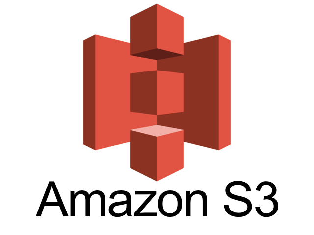

# Projeto AWS S3

**Objetivo**:

Este projeto tem como objetivo implementar uma solução robusta de armazenamento na nuvem utilizando o Amazon Simple Storage Service (S3), aproveitando ao máximo os recursos oferecidos pela AWS para garantir segurança, eficiência e escalabilidade

## 📦 Documentação

**Criação do Bucket:**

O primeiro passo consiste na criação de um ou mais buckets S3, que são contêineres para armazenar objetos na nuvem. [Caso tenha duvidas, clique aqui](https://docs.aws.amazon.com/pt_br/AmazonS3/latest/userguide/create-bucket-overview.html)

**Criptografia**

Para garantir a confidencialidade dos dados, é possível utilizar a criptografia tanto em repouso quanto em trânsito.

**Versionamento**

O versionamento de objetos no S3 permite manter múltiplas versões de um mesmo arquivo, possibilitando a recuperação de versões anteriores em caso de necessidade.
Isso ajuda a proteger os dados contra exclusões acidentais ou maliciosas.

Ativamos o versionamento no nosso bucket

**Upload do Arquivo**

Uma vez que o bucket esteja criado, os arquivos podem ser facilmente carregados para o S3 através de interfaces web, SDKs ou ferramentas de linha de comando.
O upload de arquivos pode ser automatizado e integrado a fluxos de trabalho existentes, nesse caso utilizaremos a interface pois o intuito e mostrar o S3.

1. Podemos clicar em "Upload" ou podemos arrastar o arquivo para o bucket

2. Podemos verificar que o versionamento aplicado anteriormente esta funcionando, basta repetir o upload do mesmo arquivo.

Assim conseguimos ter acesso a varias informações importantes do container

**Ciclo de Vida**

A configuração de políticas de ciclo de vida permite automatizar a transição de objetos entre classes de armazenamento (por exemplo, de S3 Standard para S3 Glacier) ou a exclusão automática de objetos após um determinado período de tempo.
Isso ajuda a otimizar os custos de armazenamento e a garantir a conformidade com requisitos de retenção de dados.

Fizemos o seguinte ciclo

**Alertas**

A configuração de alertas baseados em eventos no S3 permite monitorar atividades como uploads, downloads e alterações de permissões.
Alertas podem ser enviados por meio de notificações por email, mensagens de texto ou integrações com serviços de monitoramento.

1. Precisamos crair um SNS Simple Notification Service
2. Uma subscription no SNS com o email 
3. Validar o email

Apos realizar a ação (nesse caso foi um POST), recebemos a notificação no email.

## Finalizamos

Apos realizarmos essas configurações temos um S3 em pleno funcionamento.

⌨️ com ❤️ por [Elias Assunção](https://github.com/Hooligam) 🔥
